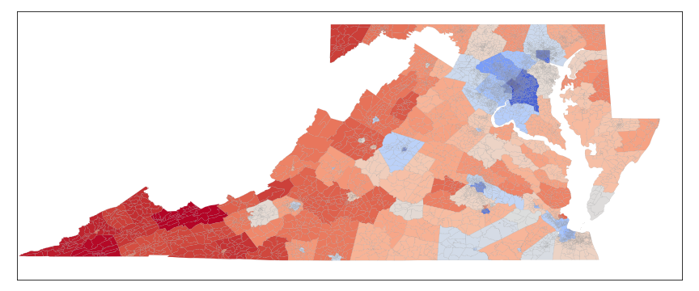

# GeographicalVisualization
Visualization techniques using geopandas

## Objectives
- Understand basics of geopandas DataFrame
- Learn how to draw detailed maps of the US with color gradations

## Special Thanks to Tim Mango
- [His Medium post](https://medium.com/@tmango/plotting-geojson-files-with-matplotlib-5ed87df570ab)
- [His final project repo](https://github.com/TimMango/.Project-DSFellowship_Final_Project)

## Examples
- [My Medium post on US 2016 Presidential Election](https://medium.com/keita-starts-data-science/the-divided-states-of-america-f42e904e76f0?source=friends_link&sk=944e362e7e7e00df349f56b1dfe53431)

